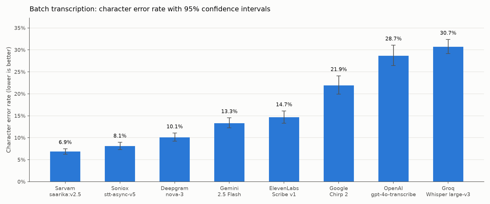
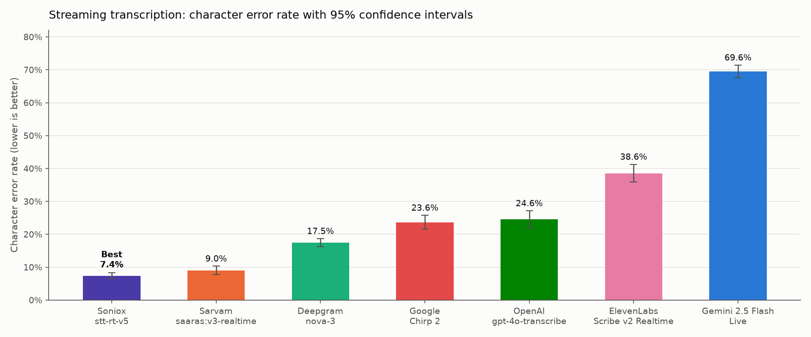
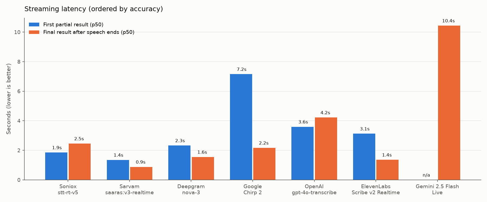
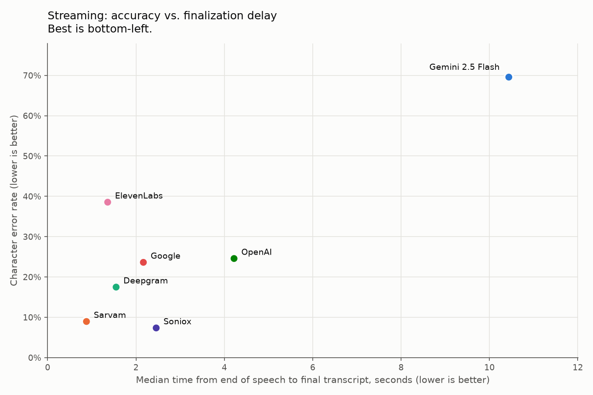
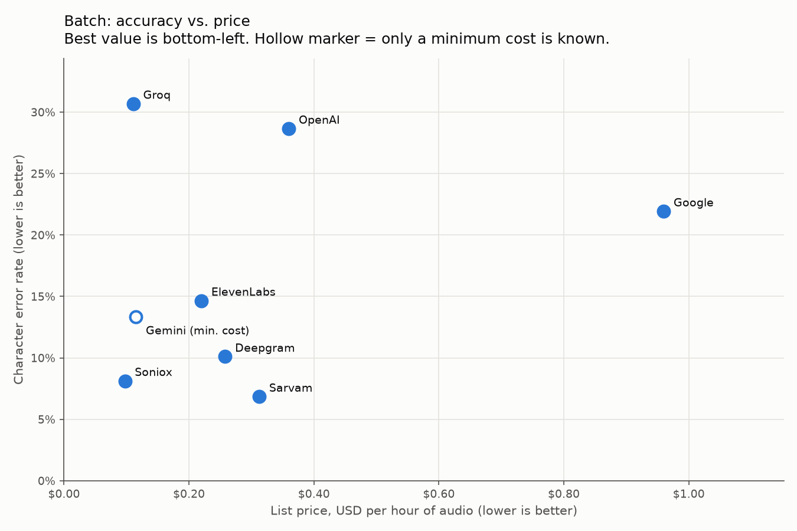
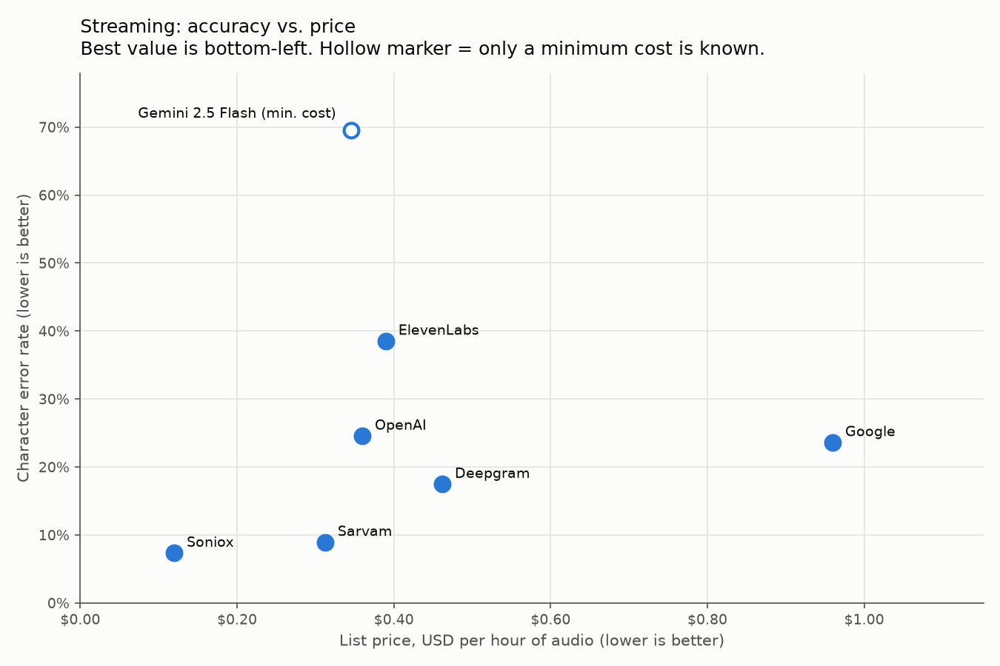
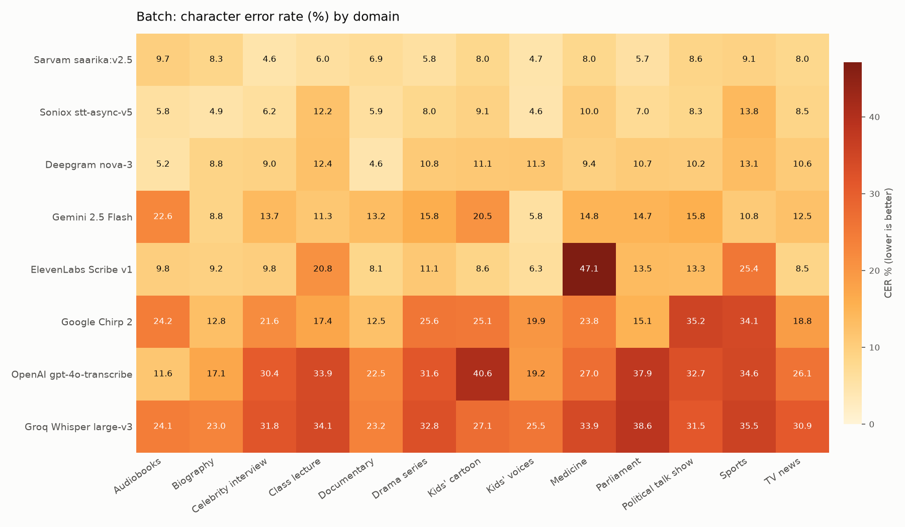
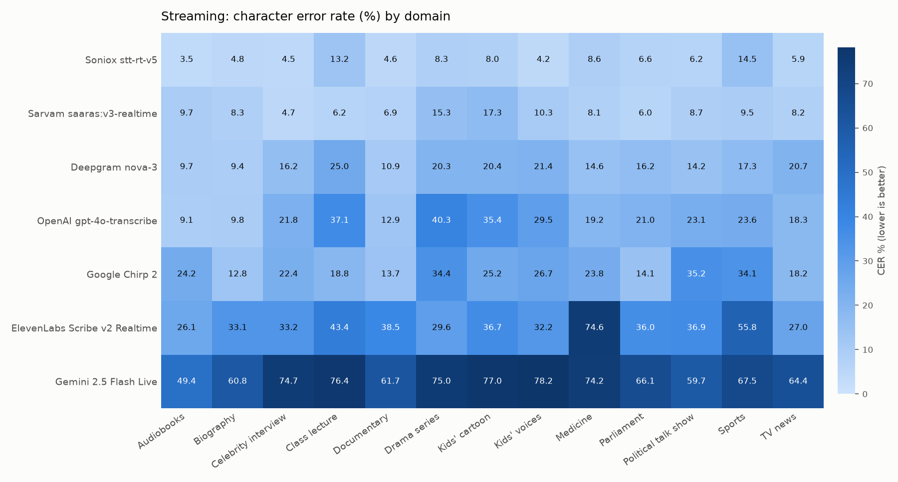

# Bangla Speech-to-Text Benchmark

**An open benchmark of 8 hosted Bengali speech-to-text (ASR) APIs on 1,001
real Bangla audio clips across 13 domains, covering both batch
transcription and real-time streaming.**

Providers tested: Sarvam AI, Soniox, Deepgram, Google (Gemini and Chirp 2),
ElevenLabs, OpenAI and Groq (Whisper). Version 1.0, tested in **September
2026**.

> Results reflect each provider's API as it behaved when we tested it.
> Vendors update models often, so check the [exact model IDs](#providers-and-exact-model-versions)
> and rerun the benchmark before relying on these numbers for a purchase decision.


## Table of contents

- [Results](#results)
  - [Batch](#batch-whole-file-transcription)
  - [Streaming](#streaming-real-time-audio-paced-like-a-live-microphone)
  - [Streaming latency](#streaming-latency)
  - [Cost](#cost)
  - [Results by domain](#results-by-domain)
  - [Key findings](#key-findings)
- [Metrics](#metrics)
- [Methodology](#methodology)
  - [Test set](#test-set) and [test set statistics](#test-set-statistics)
  - [Providers and exact model versions](#providers-and-exact-model-versions)
  - [Limitations](#limitations)
- [Reproduce it](#reproduce-it)
  - [Per-provider setup](#per-provider-setup)
- [Add a provider](#add-a-provider)
- [Repository layout](#repository-layout)
- [License](#license) · [Citation](#citation)

---

## Results

Lower is better. **CER** (character error rate) is the primary metric, and
the ranking is ordered by it. Brackets show 95% bootstrap confidence intervals.

### Batch (whole-file transcription)



| # | Provider | Model | CER | WER | Mean latency | List price / hour |
|---|---|---|---|---|---|---|
| 1 | Sarvam AI | `saarika:v2.5` | **6.9%** [6.2–7.5] | **18.2%** [17.0–19.3] | 0.99 s | $0.31 (₹30) |
| 2 | Soniox | `stt-async-v5` | 8.1% [7.3–9.0] | 21.5% [20.1–22.9] | 7.58 s | **$0.10** (estimate) |
| 3 | Deepgram | `nova-3` | 10.1% [9.2–11.1] | 23.9% [22.5–25.4] | 2.15 s | $0.26 |
| 4 | Google Gemini | `gemini-2.5-flash` | 13.3% [12.3–14.5] | 27.0% [25.5–28.6] | 3.85 s | at least $0.12 |
| 5 | ElevenLabs | `scribe_v1` (see notes) | 14.7% [13.3–16.1] | 26.0% [24.4–27.7] | 1.39 s | $0.22 (Scribe v2 price) |
| 6 | Google Cloud | `chirp_2` | 21.9% [19.9–24.1] | 41.4% [38.9–44.1] | 4.13 s | $0.96 |
| 7 | OpenAI | `gpt-4o-transcribe` | 28.7% [26.4–31.1] | 45.1% [42.9–47.3] | 1.11 s | $0.36 (estimate) |
| 8 | Groq | `whisper-large-v3` | 30.7% [29.2–32.4] | 71.7% [70.0–73.3] | 0.66 s | $0.11 (10-second minimum per request) |

### Streaming (real-time, audio paced like a live microphone)



| # | Provider | Model | CER | WER | Time to first partial (p50) | Final result after speech ends (p50) | List price / hour |
|---|---|---|---|---|---|---|---|
| 1 | Soniox | `stt-rt-v5` | **7.4%** [6.5–8.3] | **19.7%** | 1.85 s | 2.46 s | **$0.12** (estimate) |
| 2 | Sarvam AI | `saaras:v3-realtime` | 9.0% [7.8–10.3] | 20.3% | **1.35 s** | **0.88 s** | $0.31 (₹30) |
| 3 | Deepgram | `nova-3` | 17.5% [16.3–18.7] | 33.3% | 2.33 s | 1.55 s | $0.46 (regular price) |
| 4 | Google Cloud | `chirp_2` | 23.6% [21.5–25.8] | 43.8% | 7.15 s | 2.17 s | $0.96 |
| 5 | OpenAI | `gpt-4o-transcribe` (Realtime API) | 24.6% [22.1–27.1] | 42.4% | 3.60 s | 4.22 s | $0.36 (estimate) |
| 6 | ElevenLabs | `scribe_v2_realtime` | 38.6% [35.9–41.3] | 55.4% | 3.13 s | 1.36 s | $0.39 |
| 7 | Google Gemini | `gemini-2.5-flash-native-audio-preview-12-2025` (Live API) | 69.6% [67.7–71.4] | 79.2% | n/a | 10.44 s | at least $0.35 |

Groq has no streaming speech-to-text API, so it is not in the streaming table.

List prices are the providers' published pay-as-you-go rates in USD per hour
of audio, checked on each provider's own pricing page on **24 September
2026** (details and sources in [Cost](#cost)). Notes on the price column:

- **(estimate):** the provider bills per token; the price shown is the
  provider's own per-hour estimate.
- **at least:** a minimum; it covers audio input only (see [Cost](#cost)).
- **10-second minimum per request:** Groq bills every request as at least
  10 seconds of audio.
- **(regular price):** Deepgram showed a temporary discount ($0.29 per hour)
  when we checked; the regular price is shown.
- **Scribe v2 price:** ElevenLabs no longer lists `scribe_v1`, so the
  Scribe v2 price is shown (see [Limitations](#limitations)).

### Streaming latency

How quickly each streaming API responds, measured on every clip while audio
was sent at real-time pace (see [Streaming setup](#streaming-setup)). Values
are median (p50) / 95th percentile (p95).



| Provider | First partial result | First final segment | Final result after speech ends | Mean session time | Real-time factor | Partial-result CER |
|---|---|---|---|---|---|---|
| Soniox `stt-rt-v5` | 1.85 s / 2.21 s | 3.24 s / 7.40 s | 2.46 s / 2.80 s | 5.48 s | 2.18 / 3.86 | 61.7% |
| Sarvam `saaras:v3-realtime` | 1.35 s / 1.60 s | 2.82 s / 8.53 s | 0.88 s / 1.42 s | 3.98 s | 1.43 / 1.91 | 57.9% |
| Deepgram `nova-3` | 2.33 s / 3.16 s | 3.34 s / 6.49 s | 1.55 s / 1.97 s | 4.59 s | 1.74 / 2.79 | 60.5% |
| Google `chirp_2` | 7.15 s / 8.98 s | 4.15 s / 9.33 s | 2.17 s / 2.94 s | 5.30 s | 1.99 / 4.04 | 50.1% |
| OpenAI `gpt-4o-transcribe` | 3.60 s / 8.68 s | 3.97 s / 9.15 s | 4.22 s / 4.76 s | 7.32 s | 3.06 / 5.97 | 56.6% |
| ElevenLabs `scribe_v2_realtime` | 3.13 s / 3.40 s | 3.22 s / 8.78 s | 1.36 s / 1.78 s | 4.41 s | 1.67 / 2.49 | 60.7% |
| Gemini Live (native audio) | n/a / n/a | 3.46 s / 4.66 s | 10.44 s / 30.92 s | 15.55 s | 6.22 / 17.87 | n/a |

The real-time factor here is total session time divided by audio length.
It is above 1 for every provider because audio is sent at real-time pace and
the session also includes the wait for the final result, which is a large
share of a 3-second clip. Gemini Live returned no interim results, so its
first-partial and partial-result figures are n/a.



### Cost

What you pay depends on two things: the provider's list price and how it
rounds each request. Our clips are short (97% are under 10 seconds, 3 s on
average), which is typical of voice commands and conversational turns. With
that kind of audio, a per-request minimum or rounding up to the next second
can cost much more than the list price.

| Mode | Provider | List price / hour | Effective price / hour on our clips | Cost of our run (see note below) | How firm |
|---|---|---|---|---|---|
| Batch | Soniox | $0.10 | $0.10 | $0.09 | estimate |
| Batch | Gemini 2.5 Flash | at least $0.12 | at least $0.12 | at least $0.10 | minimum |
| Batch | ElevenLabs Scribe | $0.22 | $0.22 | $0.18 | estimate |
| Batch | Deepgram Nova-3 | $0.26 | $0.26 | $0.21 | exact |
| Batch | Sarvam Saarika | $0.31 | $0.36 | $0.30 | estimate |
| Batch | OpenAI gpt-4o-transcribe | $0.36 | $0.36 | $0.30 | estimate |
| Batch | Groq Whisper large-v3 | $0.11 | **$0.38** | $0.31 | estimate |
| Batch | Google Chirp 2 | $0.96 | $1.12 | $0.93 | exact |
| Streaming | Soniox | $0.12 | $0.17 | $0.15 | estimate |
| Streaming | Sarvam Saaras | $0.31 | $0.36 | $0.30 | estimate |
| Streaming | Deepgram Nova-3 | $0.46 | $0.46 | $0.38 | exact |
| Streaming | OpenAI gpt-4o-transcribe | $0.36 | $0.36 | $0.30 | estimate |
| Streaming | ElevenLabs Scribe v2 Realtime | $0.39 | $0.39 | $0.32 | estimate |
| Streaming | Gemini 2.5 Flash Live | at least $0.35 | at least $0.35 | at least $0.29 | minimum |
| Streaming | Google Chirp 2 | $0.96 | $1.12 | $0.93 | exact |

- **exact:** the published rate multiplied by billed time, where the
  provider publishes all of its billing rules (Deepgram, Google).
- **estimate:** the provider bills per token, or doesn't publish exactly
  how each request is rounded. We used the provider's own conversion
  figures (Soniox, OpenAI), billed exact audio length (ElevenLabs, Groq
  above its 10-second minimum), or rounded each request up to the next
  second (Sarvam).
- **minimum:** Gemini also bills output tokens: thinking tokens for
  `gemini-2.5-flash`, and a generated spoken reply for the Live API. The
  benchmark didn't record those, so only audio input is priced and the real
  cost is higher.

Note on cost of our run: all 1,001 clips, except where a provider failed on a few (Deepgram and
Chirp 2: 1,000; OpenAI streaming: 995; Gemini streaming: 997).

Notes:

- **Groq** bills at least 10 seconds per request, so on short clips it costs
  3.4× its list price.
- **Sarvam** and **Google** round every request up to the next second, which
  adds about 17% on our clips (3 seconds on average). Sarvam's rounding is our reading of "billed
  per second"; Google states it explicitly. Google also offers Dynamic
  Batch recognition at $0.003/minute ($0.18/hour) for jobs that can wait,
  which we did not test.
- **Soniox real-time** bills on streaming-session time, which includes the
  wait for the final transcript after the audio ends. On our short clips
  that adds about 40% to the input cost.
- **Sarvam prices in rupees.** We converted at the European Central Bank
  reference rate for 24 September 2026 (₹95.96 per US$).
- Only the base pay-as-you-go rate is used. Free credits, volume tiers,
  committed-use discounts and promotions are excluded.





Every rate, with the exact text quoted from the provider's page, its URL
and the date checked, is in [`pricing/prices.yaml`](pricing/prices.yaml).
[`src/cost.py`](src/cost.py) recomputes the table above.

### Results by domain

CER for each of the 13 BanSpeech domains (77 clips each). The best provider
in each domain is in **bold**. Columns are ordered by overall accuracy.



**Batch**

| Domain | Sarvam `saarika:v2.5` | Soniox `stt-async-v5` | Deepgram `nova-3` | Gemini `gemini-2.5-flash` | ElevenLabs `scribe_v1` | Google `chirp_2` | OpenAI `gpt-4o-transcribe` | Groq `whisper-large-v3` |
|---|---|---|---|---|---|---|---|---|
| Audiobooks | 9.7% | 5.8% | **5.2%** | 22.6% | 9.8% | 24.2% | 11.6% | 24.1% |
| Biography | 8.3% | **4.9%** | 8.8% | 8.8% | 9.2% | 12.8% | 17.1% | 23.0% |
| Celebrity interview | **4.6%** | 6.2% | 9.0% | 13.7% | 9.8% | 21.6% | 30.4% | 31.8% |
| Class lecture | **6.0%** | 12.2% | 12.4% | 11.3% | 20.8% | 17.4% | 33.9% | 34.1% |
| Documentary | 6.9% | 5.9% | **4.6%** | 13.2% | 8.1% | 12.5% | 22.5% | 23.2% |
| Drama series | **5.8%** | 8.0% | 10.8% | 15.8% | 11.1% | 25.6% | 31.6% | 32.8% |
| Kids' cartoon | **8.0%** | 9.1% | 11.1% | 20.5% | 8.6% | 25.1% | 40.6% | 27.1% |
| Kids' voices | 4.7% | **4.6%** | 11.3% | 5.8% | 6.3% | 19.9% | 19.2% | 25.5% |
| Medicine | **8.0%** | 10.0% | 9.4% | 14.8% | 47.1% | 23.8% | 27.0% | 33.9% |
| Parliament | **5.7%** | 7.0% | 10.7% | 14.7% | 13.5% | 15.1% | 37.9% | 38.6% |
| Political talk show | 8.6% | **8.3%** | 10.2% | 15.8% | 13.3% | 35.2% | 32.7% | 31.5% |
| Sports | **9.1%** | 13.8% | 13.1% | 10.8% | 25.4% | 34.1% | 34.6% | 35.5% |
| TV news | **8.0%** | 8.5% | 10.6% | 12.5% | 8.5% | 18.8% | 26.1% | 30.9% |



**Streaming**

| Domain | Soniox `stt-rt-v5` | Sarvam `saaras:v3-realtime` | Deepgram `nova-3` | Google `chirp_2` | OpenAI `gpt-4o-transcribe` | ElevenLabs `scribe_v2_realtime` | Gemini Live (native audio) |
|---|---|---|---|---|---|---|---|
| Audiobooks | **3.5%** | 9.7% | 9.7% | 24.2% | 9.1% | 26.1% | 49.4% |
| Biography | **4.8%** | 8.3% | 9.4% | 12.8% | 9.8% | 33.1% | 60.8% |
| Celebrity interview | **4.5%** | 4.7% | 16.2% | 22.4% | 21.8% | 33.2% | 74.7% |
| Class lecture | 13.2% | **6.2%** | 25.0% | 18.8% | 37.1% | 43.4% | 76.4% |
| Documentary | **4.6%** | 6.9% | 10.9% | 13.7% | 12.9% | 38.5% | 61.7% |
| Drama series | **8.3%** | 15.3% | 20.3% | 34.4% | 40.3% | 29.6% | 75.0% |
| Kids' cartoon | **8.0%** | 17.3% | 20.4% | 25.2% | 35.4% | 36.7% | 77.0% |
| Kids' voices | **4.2%** | 10.3% | 21.4% | 26.7% | 29.5% | 32.2% | 78.2% |
| Medicine | 8.6% | **8.1%** | 14.6% | 23.8% | 19.2% | 74.6% | 74.2% |
| Parliament | 6.6% | **6.0%** | 16.2% | 14.1% | 21.0% | 36.0% | 66.1% |
| Political talk show | **6.2%** | 8.7% | 14.2% | 35.2% | 23.1% | 36.9% | 59.7% |
| Sports | 14.5% | **9.5%** | 17.3% | 34.1% | 23.6% | 55.8% | 67.5% |
| TV news | **5.9%** | 8.2% | 20.7% | 18.2% | 18.3% | 27.0% | 64.4% |

With 77 clips per domain, per-domain numbers are much noisier than the
overall scores. Treat small differences within a domain as ties.

### Key findings

- **Sarvam AI is the most accurate batch API for Bangla** at 6.9% CER, and
  also one of the fastest (about 1 s per clip). Its lead over Soniox is
  statistically significant (paired bootstrap, p ≈ 0.998).
- **Soniox is the most accurate streaming API** (7.4% CER). Sarvam is close
  behind and returns its final transcript fastest after the speaker stops.
- **Gemini 2.5 Flash and ElevenLabs Scribe are a statistical tie** in batch
  mode, as are Chirp 2 and OpenAI in streaming mode (their confidence
  intervals overlap; see [`results/pairwise.csv`](results/pairwise.csv)).
- **The most accurate providers are also among the cheapest.** Soniox
  ($0.10/hour) and Sarvam (₹30 ≈ $0.31/hour) lead on accuracy and cost less
  than Deepgram streaming, OpenAI, ElevenLabs streaming and Google Chirp 2.
  Chirp 2 is the most expensive option and ranks 6th in batch.
- **General-purpose models struggle with Bangla.** OpenAI
  `gpt-4o-transcribe` and Whisper large-v3 have 4–5× the character error
  rate of the leaders.
- **Streaming usually costs accuracy**, but not always. Soniox's real-time
  model was slightly *more* accurate than its batch model, while Deepgram,
  ElevenLabs and Gemini lost substantial accuracy in streaming mode.
- **Domain matters.** ElevenLabs Scribe (batch) reaches 47% CER on medical
  lectures but under 10% on audiobooks and TV news. See the per-domain
  breakdown in [`results/by_domain.csv`](results/by_domain.csv).

Full results:

| file | contents |
|---|---|
| [`results/leaderboard.csv`](results/leaderboard.csv) | batch: CER, WER, coverage, mean latency, real-time factor p50/p95 |
| [`results/leaderboard_ci.csv`](results/leaderboard_ci.csv) | batch: CER/WER with 95% bootstrap confidence intervals |
| [`results/by_domain.csv`](results/by_domain.csv) | batch: CER per provider × domain |
| [`results/per_file.csv`](results/per_file.csv) | batch: every clip × provider, with reference and raw transcript |
| [`results/streaming_leaderboard.csv`](results/streaming_leaderboard.csv) | streaming: accuracy plus latency and stability metrics |
| [`results/streaming_leaderboard_ci.csv`](results/streaming_leaderboard_ci.csv) | streaming: CER/WER with 95% confidence intervals |
| [`results/streaming_by_domain.csv`](results/streaming_by_domain.csv) | streaming: CER per provider × domain |
| [`results/streaming_per_file.csv`](results/streaming_per_file.csv) | streaming: every clip × provider, with timings and transcripts |
| [`results/cost.csv`](results/cost.csv) | batch: list and effective price per hour, cost of the run, sources |
| [`results/streaming_cost.csv`](results/streaming_cost.csv) | streaming: the same |
| [`pricing/prices.yaml`](pricing/prices.yaml) | every rate with its source URL, quoted page text and date checked |
| [`results/pairwise.csv`](results/pairwise.csv) | paired bootstrap tests between providers adjacent in the ranking |
| [`results/dashboard.html`](results/dashboard.html) | interactive charts (download and open it in a browser) |

---

## Metrics

### Character error rate (CER), the primary metric

CER is the number of character edits needed to turn a provider's transcript
into the reference transcript, divided by the number of characters in the
reference:

```
CER = (S + D + I) / N
```

where S, D and I are character substitutions, deletions and insertions, and
N is the number of characters in the reference. Both texts are normalized
first (see [Scoring](#scoring)). We report **corpus-level** CER: edits and
reference characters are summed over all clips before dividing. A CER of
6.9% means about 7 characters in every 100 are wrong. CER can exceed 100%
when a transcript contains many inserted characters.

### Word error rate (WER)

The same formula with words instead of characters. WER is the standard
metric for English, but Bangla word boundaries are inconsistent, so one
spacing difference (for example a split compound) counts as two word
errors even when every letter is right. That is why WER is much higher
than CER for every provider here, and why CER is the primary metric.

### Confidence interval

The range the true CER likely falls in (95% confidence), given that the
test set is a sample of 1,001 clips. Two providers whose intervals overlap
may not really differ; [`results/pairwise.csv`](results/pairwise.csv) tests
each adjacent pair directly.

### Streaming latency metrics

Measured on every clip while audio is sent at real-time pace, timed from
the start of each streaming session:

- **First partial result:** time until the first interim (not yet final)
  transcript arrives. This is how quickly a live caption starts appearing.
- **First final segment:** time until the first finalized piece of text
  arrives.
- **Final result after speech ends:** total session time minus audio
  length. This is the wait a user notices between finishing speaking and
  getting the finished transcript, which matters most for voice agents.
- **Real-time factor (RTF):** total session time divided by audio length.
  For batch it is request time divided by audio length; below 1 means
  faster than real time.
- **Partial-result CER:** mean CER of all interim transcripts against the
  reference. Lower means partial results are closer to the final text and
  safer to show before the result is final.

### Cost metrics

- **List price per hour:** the provider's published pay-as-you-go rate per
  hour of audio.
- **Effective price per hour:** what our clips actually cost per hour of
  audio once each provider's billing rules (minimums, rounding, session
  billing) are applied per request.

See [Cost](#cost) for sources and how firm each figure is.

## Methodology

### Test set

- **Source:** [BanSpeech](https://huggingface.co/datasets/SUST-CSE-Speech/banspeech)
  (SUST CSE Speech group), a human-annotated, multi-domain Bangla ASR test
  corpus.
- **Sample:** 1,001 utterances, with **77 randomly sampled from each of 13
  domains**: audiobooks, biography, celebrity interviews, class lectures,
  documentaries, drama series, kids' cartoons, kids' voices, medicine,
  parliament speeches, political talk shows, sports and TV news. Regional
  dialect clips were not included in v1.0.
- **Fixed for every provider.** The exact clip list and reference
  transcripts are in [`data/test_set.csv`](data/test_set.csv), so every
  provider was scored on the same audio against the same references.

### Test set statistics

| Domain | Clips | Audio (minutes) | Mean clip length | Reference words |
|---|---|---|---|---|
| Audiobooks | 77 | 2.2 | 1.7 s | 409 |
| Biography | 77 | 3.0 | 2.3 s | 396 |
| Celebrity interview | 77 | 5.2 | 4.1 s | 854 |
| Class lecture | 77 | 5.0 | 3.9 s | 943 |
| Documentary | 77 | 3.1 | 2.4 s | 457 |
| Drama series | 77 | 4.4 | 3.4 s | 774 |
| Kids' cartoon | 77 | 3.4 | 2.7 s | 524 |
| Kids' voices | 77 | 6.5 | 5.0 s | 947 |
| Medicine | 77 | 3.5 | 2.7 s | 481 |
| Parliament | 77 | 3.9 | 3.0 s | 596 |
| Political talk show | 77 | 3.0 | 2.4 s | 498 |
| Sports | 77 | 3.3 | 2.6 s | 586 |
| TV news | 77 | 3.4 | 2.6 s | 531 |
| **Total** | **1,001** | **50.0** | **3.0 s** | **7,996** |

- Clip length ranges from 0.7 s to 26.8 s (median 2.1 s; 80% of clips are
  between 1.0 s and 5.8 s). 97% of clips are under 10 seconds.
- References total 7,996 words and 43,411 characters.
- Audio is 16 kHz WAV, as distributed by BanSpeech.

These are short utterances, like voice commands or conversational turns.
Results on long recordings (meetings, podcasts, calls) may differ,
particularly for cost (see [Cost](#cost)) and for providers that use
context across a long file.

### Scoring

- **CER is the primary metric.** Bangla word segmentation is inconsistent
  (compounds, suffixes and spacing vary between annotators and engines), so
  WER penalizes spacing choices that aren't real recognition errors. WER is
  reported alongside CER.
- **Corpus-level rates** are total edits divided by total reference length
  across all clips, not an average of per-clip rates. Short clips therefore
  don't dominate the score.
- **Identical normalization** is applied to both the reference and every
  provider's output before scoring ([`src/normalize.py`](src/normalize.py)):
  Unicode NFC, removal of zero-width joiners and non-joiners, removal of the
  danda and other punctuation, Bangla digits mapped to ASCII, lowercasing of
  Latin text, and whitespace collapsed. Without this step, formatting
  choices alone shift scores by 10–20%.
- **Confidence intervals** come from 10,000 bootstrap resamples of the clip
  set ([`src/confidence_intervals.py`](src/confidence_intervals.py)).
  Pairwise comparisons use a paired bootstrap over the clips both providers
  transcribed.
- **Coverage.** A clip that errored for a provider is excluded from that
  provider's score and not counted as 100% error. Coverage was at least
  99.4% for every provider (see `files_scored` in the leaderboards).

### Batch setup

Each clip is sent to the provider in a single request, using the settings
in [`config.yaml`](config.yaml). Latency is the wall-clock request time from
our client. The real-time factor (RTF) is that time divided by the clip's
audio duration.

### Streaming setup

Each clip is split into 100 ms, 16-bit PCM chunks and sent over the
provider's streaming API **paced in real time**: a chunk is sent only after
as much wall-clock time has passed as the audio it contains. This simulates
a live microphone. Every interim and final result is timestamped, so the
latency metrics reflect real streaming behavior.

| metric | meaning |
|---|---|
| `first_partial_p50_s` / `p95_s` | time until the first interim hypothesis appears (perceived responsiveness) |
| `first_final_p50_s` / `p95_s` | time until the first finalized segment |
| `finalization_p50_s` / `p95_s` | total session time minus audio duration: the delay a user notices after they stop talking |
| `total_latency_mean_s` | wall-clock time for the whole streamed session |
| `rtfp50` / `rtfp95` | total session time ÷ audio duration |
| `partial_stability_cer` | mean CER of all interim hypotheses against the reference (lower means partials are safer to show before finalization) |

Accuracy in streaming mode is scored on the final transcript in the same way
as batch, so the two tables can be compared directly.

### Providers and exact model versions

| Provider | Batch model | Streaming model | Language setting |
|---|---|---|---|
| Sarvam AI | `saarika:v2.5` | `saaras:v3-realtime` | `bn-IN` |
| Soniox | `stt-async-v5` | `stt-rt-v5` | hint `bn` |
| Deepgram | `nova-3` | `nova-3` | `bn` |
| Google Gemini | `gemini-2.5-flash` | `gemini-2.5-flash-native-audio-preview-12-2025` | batch: Bangla named in the prompt; streaming: auto-detect |
| ElevenLabs | `scribe_v1` | `scribe_v2_realtime` | `ben` |
| Google Cloud STT v2 | `chirp_2` (`us-central1`) | `chirp_2` | `bn-BD` |
| OpenAI | `gpt-4o-transcribe` | `gpt-4o-transcribe` (Realtime API) | `bn` |
| Groq | `whisper-large-v3` | — | `bn` |

All providers were run with default settings apart from language. No
custom vocabulary or fine-tuning was used. Gemini 2.5 Flash (batch) is a
general-purpose model rather than a dedicated ASR endpoint, so it receives
a short fixed instruction to transcribe the Bangla audio verbatim (see
[`src/providers/gemini.py`](src/providers/gemini.py)). No other provider
received a prompt.


Provider documentation:
[Sarvam AI](https://www.sarvam.ai/apis/speech-to-text) ·
[Soniox](https://soniox.com/docs/stt/get-started) ·
[Deepgram](https://developers.deepgram.com/docs/pre-recorded-audio) ·
[Gemini API](https://ai.google.dev/gemini-api/docs/audio) ·
[ElevenLabs](https://elevenlabs.io/docs/overview/capabilities/speech-to-text) ·
[Google Cloud Chirp 2](https://cloud.google.com/speech-to-text/v2/docs/chirp_2-model) ·
[OpenAI](https://developers.openai.com/api/docs/guides/speech-to-text) ·
[Groq](https://console.groq.com/docs/speech-to-text)

### Limitations

- **Point-in-time snapshot.** Hosted models change without notice.
  Everything here reflects the APIs as of September 2026.
- **Read and broadcast speech dominate.** BanSpeech covers 13 domains, but
  not phone-call audio, heavy background noise or code-switched
  conversational speech. Regional dialects are left out of v1.0.
- **Language tags differ.** Some providers only accept `bn-IN` or `bn-BD`.
  We used each provider's documented Bangla option, and the choice may
  affect results slightly (for Chirp 2 we used `bn-BD`).
- **Latency depends on the network.** All requests were sent from a single
  client location, and absolute latencies will vary with region and time.
- **Gemini Live API partials.** No interim transcripts were received from
  the Gemini Live API during our run, so its first-partial and stability
  metrics are empty. The Live API adapter also sets no language hint, which
  may partly explain Gemini's much weaker streaming accuracy.
- **ElevenLabs batch model.** The batch run requested `scribe_v1`.
  ElevenLabs' changelog (8 June 2026) said `scribe_v1` would be removed on
  9 July 2026, before our run in September, yet every request succeeded. We
  can't tell from the API response whether `scribe_v1` or `scribe_v2`
  served these requests.
- **Prices change.** They were checked on 24 September 2026. Token-billed
  costs (Soniox, OpenAI) are estimates, and Gemini costs are minimums; see
  [Cost](#cost).
- **Hosted APIs only.** Open-weight models run locally are not included in
  v1.0.

### Conflict of interest

<!-- TODO before publishing: state any commercial relationship (partner,
reseller, customer, investor, etc.) Riverborn AI has with the providers
tested, or write "None." -->

The benchmark was designed, run and funded by Riverborn AI. No provider
sponsored or reviewed this benchmark before publication.

---

## Reproduce it

### 1. Install

```bash
git clone https://github.com/riverbornai/bangla-speech-to-text-benchmark
cd bangla-speech-to-text-benchmark
python3 -m venv .venv && source .venv/bin/activate   # or: uv sync
pip install -r requirements.txt
```

### 2. Check the published numbers (no API keys needed)

```bash
python src/confidence_intervals.py    # recomputes CER/WER + CIs from results/*per_file.csv
python src/cost.py                    # recomputes cost from pricing/prices.yaml + clip durations
```

### 3. Download the audio

```bash
python download_benchmark_audio.py    # the 1,001 test clips -> wavs_1001/
```

### 4. Add API keys

```bash
cp .env.sample .env      # fill in the keys you have; providers without a key are skipped
set -a && source .env && set +a
```

For Google Chirp 2, use a dedicated service account that only has the Cloud
Speech-to-Text role, and keep its JSON key file outside the repository.

### 5. Run and score

```bash
# Smoke test: one clip through every provider you have a key for
python src/smoke_test.py

# Batch
python src/run_transcription.py                        # all enabled providers
python src/run_transcription.py sarvam_saarika --limit 3
python src/score.py                                    # -> results/leaderboard.csv etc.

# Streaming (real-time paced, so a full run takes as long as the audio)
python src/run_streaming_transcription.py
python src/run_streaming_transcription.py soniox_rt_streaming --limit 3
python src/score_streaming.py                          # -> results/streaming_leaderboard.csv etc.

# Confidence intervals and dashboard
python src/confidence_intervals.py
python generate_dashboard.py                           # -> results/dashboard.html

# Cost and README charts
python src/cost.py                                     # -> results/cost.csv, streaming_cost.csv
python src/plot_results.py                             # -> results/plots/*.png
```

Transcripts are cached in `results/raw/` and `results/raw_streaming/`, and
reruns only fill gaps, so a paid API is never called twice for the same
clip. A failed request is logged per clip and doesn't stop the run.

### Per-provider setup

Each provider needs its own key in `.env`. A provider whose key is missing
is skipped. Model IDs, language codes and regions are set in
[`config.yaml`](config.yaml) (batch) and
[`streaming-config.yaml`](streaming-config.yaml) (streaming).

| Provider | Environment variables | Batch name | Streaming name |
|---|---|---|---|
| Sarvam AI | `SARVAM_API_KEY` | `sarvam_saarika` | `sarvam_saaras_realtime_streaming` |
| Soniox | `SONIOX_API_KEY` (optional `SONIOX_API_BASE_URL` for a regional endpoint) | `soniox` | `soniox_rt_streaming` |
| Deepgram | `DEEPGRAM_API_KEY` | `deepgram_nova3` | `deepgram_nova3_streaming` |
| Gemini API | `GEMINI_API_KEY` | `gemini_25_flash` | `gemini_25_flash_streaming` |
| ElevenLabs | `ELEVENLABS_API_KEY` | `elevenlabs_scribe` | `elevenlabs_scribe_streaming` |
| Google Cloud Chirp 2 | `GOOGLE_CLOUD_PROJECT`, `GOOGLE_APPLICATION_CREDENTIALS` | `google_chirp2` | `google_chirp2_streaming` |
| OpenAI | `OPENAI_API_KEY` | `openai_4o` | `openai_4o_streaming` |
| Groq | `GROQ_API_KEY` | `groq_whisper` | — |

Run one provider by passing its name:

```bash
python src/smoke_test.py --provider deepgram_nova3            # one clip, checks the key works
python src/run_transcription.py deepgram_nova3 --limit 3       # batch, first 3 clips
python src/run_transcription.py deepgram_nova3                 # batch, full test set
python src/run_streaming_transcription.py deepgram_nova3_streaming --limit 3
```

Provider-specific notes:

- **Google Chirp 2** needs the Cloud Speech-to-Text API enabled in
  `GOOGLE_CLOUD_PROJECT`, and a service account key with only the Cloud
  Speech-to-Text role. Chirp 2 is only available in some regions
  (`us-central1`, `europe-west4`, `asia-southeast1`); set `location` in the
  config.
- **Sarvam** accepts `bn-IN` as the Bangla language code.
- **ElevenLabs** takes ISO 639-3 language codes (`ben`). `scribe_v1` is
  deprecated (ElevenLabs scheduled its removal for 9 July 2026), so consider
  `model_id: scribe_v2` in `config.yaml` for new runs.
- **OpenAI streaming** resamples the 16 kHz audio to 24 kHz inside the
  adapter, because the Realtime API only accepts 24 kHz PCM.
- **Gemini Live** preview model IDs are date-stamped and replaced often; if
  the configured ID returns 404, pick the current one from the Gemini
  models page.

### Build a different sample

To change the sample size or include the dialect clips, first download the
full BanSpeech dump (about 800 MB):

```bash
python3 -c "
from huggingface_hub import hf_hub_download
import zipfile
p = hf_hub_download('SUST-CSE-Speech/banspeech', 'zipped_data/banspeech.zip', repo_type='dataset')
zipfile.ZipFile(p).extractall('.')
"
python src/build_benchmark_set.py --per-domain 100 --skip-dialects --seed 42
```

This writes `wavs_<N>/` and `data/test_set_<N>.csv`. Point `audio_dir` and
`test_set` in `config.yaml` (and `streaming-config.yaml`) at them.

---

## Add a provider

**Batch:** add `src/providers/<name>.py` exposing
`transcribe(wav_path, cfg) -> str`, register it in `REGISTRY` in
[`src/providers/__init__.py`](src/providers/__init__.py), and add a block to
`config.yaml`.

**Streaming:** add `src/providers/<name>_streaming.py` exposing
`stream_transcribe(wav_path, cfg) -> dict` (see
[`google_stt_streaming.py`](src/providers/google_stt_streaming.py) for the
expected keys), register it in `STREAMING_REGISTRY`, and add a block to
`streaming-config.yaml`.

Pull requests with new providers, or fixes to provider settings, are
welcome. If you work at one of the providers tested and think your API was
configured unfairly, please open an issue and we will rerun it.

## Repository layout

```
config.yaml                    batch providers, model IDs, language codes
streaming-config.yaml          streaming providers
data/test_set.csv              the 1,001-clip test set (file paths, domains, reference transcripts)
download_benchmark_audio.py    fetches the test-set audio from Hugging Face
src/normalize.py               shared Bangla text normalizer
src/references.py              loads the test set
src/providers/                 one adapter per API (batch and streaming)
src/smoke_test.py              one clip through every keyed provider
src/run_transcription.py       cached, concurrent batch runner
src/run_streaming_transcription.py  cached, real-time-paced streaming runner
src/score.py                   batch scoring -> results/
src/score_streaming.py         streaming scoring -> results/
src/confidence_intervals.py    bootstrap CIs and pairwise significance tests
src/cost.py                    prices every model from pricing/prices.yaml -> results/cost.csv
src/plot_results.py            renders the README charts -> results/plots/
pricing/prices.yaml            published rates with source URLs, quoted text and date checked
src/build_benchmark_set.py     draws a new stratified sample from a full BanSpeech dump
generate_dashboard.py          results CSVs -> results/dashboard.html
results/                       published v1.0 results
```

## License

- **Code:** [MIT](LICENSE).
- **Test-set transcripts** (`data/test_set.csv` and the `ref` columns in
  `results/*per_file.csv`): from BanSpeech, redistributed under
  **[CC BY-NC 4.0](https://creativecommons.org/licenses/by-nc/4.0/)**,
  for non-commercial use only. See [`data/README.md`](data/README.md).
- **Audio** is not redistributed. The download script fetches it from the
  original BanSpeech dataset.

## Citation

If you use this benchmark, please cite it using [`CITATION.cff`](CITATION.cff)
(GitHub's "Cite this repository" button) and also cite the
[BanSpeech dataset](https://huggingface.co/datasets/SUST-CSE-Speech/banspeech).

## Acknowledgements

Thanks to the SUST CSE Speech group for creating and openly releasing
BanSpeech.
